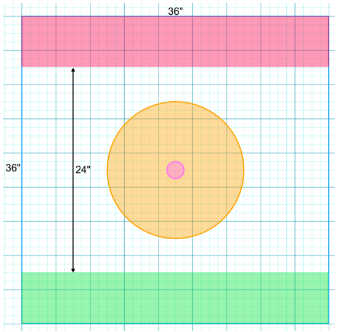

## Meatgrinder

* ### Forces

No special restrictions apply to the models the players can include in their Forces in this scenario.

Additionally, each player will need 4-6 small, expendable models.

* ### The Battlefield

The battlefield is 36”x36”. The players roll-off and the winner sets up the terrain for the game, with the following additional rules.

**Arena**  
The area within 8” of the center of the battlefield should contain only sparse terrain, with no Impassible Terrain and only a few pieces of cover. It should not include any Difficult or Dangerous Terrain. This area is the Arena.

**Objective**  
Place a single 1” objective marker in the center of the battlefield.

* ### Deployment

The player that did not set up the terrain chooses which Deployment Zone will be theirs. The other Deployment Zone is their opponent’s. The players then alternate deploying their models one at a time, starting with the player who has more models in their Warband (roll-off if both players have the same number of models). Models must be set up wholly within their own Deployment Zone. If a player runs out of models to set up, the other player sets up all their remaining models, one after another until they have none left. Once the players have set up their models, deployment ends and the game begins.

**Infiltrators**  
Infiltrators can deploy normally or by using their special deployment rules.

* ### Endless Reinforcements

At the start of the game, after deploying normal models, each player deploys D3+3 Fodder models within their Deployment Zone. Roll only once, and each player deploys the same number.

At the start of each Turn after the first, each player redeploys all of their Fodder that have been taken Out of Action, within their deployment zone. The player with the initiative places first, and players alternate.

These models have the following statistics:

#### Fodder

| Name | Movement | Ranged | Melee | Armour | Base |
| :---- | :---- | :---- | :---- | :---- | :---- |
| Fodder | 6”/Infantry | \-1 | \-1 | 0 | 25mm |

**Battlekit**  
The Fodder is equipped with a Close Combat Weapon and a Simple Ranged Weapon.

* **Close Combat Weapon.** Melee  
* **Simple Ranged Weapon.** 12”

**Abilities**

* **Expendable.** The Fodder is not counted as part of your Warband for the purposes of Morale.  
* **Masses.** When you activate the Fodder, you must also activate another Fodder as if they were a Fireteam, if there is another of your Fodder that has not been activated this Turn.  
* **Vulnerable.** Injury rolls made against the Fodder are always considered a Bloodbath.

**Keywords**  
The Fodder has your Faction Keyword

### Game Length

At the end of the fourth Turn, one player rolls a D6. On a 1 or 2, the game ends immediately. On a 3 or more, the game will end at the end of the fifth Turn.

* ### Victory Conditions

A player wins this scenario immediately if there are no enemy models on the battlefield or if the opposing Warband flees (typically due to failing a Morale Check). Otherwise, the player with more Victory Points at the end of the game is the winner.

**Victory Points**  
At the end of each Turn, each player earns 1 VP for each of their models within 3” of the Objective that is not Down.

* Players earn 1 VP for each scored Glorious Deed, as normal.

* ### Glorious Deeds

**Chew Through.** A friendly model takes at least 4 enemy Fodder Out of Action.  
**Gladiator.** A friendly model takes at least 2 non-Fodder enemies Out of Action during a single Activation, while it and each of those enemies are in the Arena.  
**Kaboom\!** A friendly model hits at least 5 models, enemy or friendly, with a BLAST attack.  
**King of the Hill.** A friendly model ends three Activations in a row within 3” of the Objective.  
**Pile of Bodies.** At the end of a Turn, there are no Fodder models on the battlefield belonging to either player. Both players score this Glorious Deed.  
**Resist and Bite.** A friendly model that began its Activation Down takes an enemy model Out of Action during that Activation.  
**Sniper.** A friendly model takes an enemy ELITE model Out of Action with a Ranged Weapon Attack that has the Long Range modifier.

