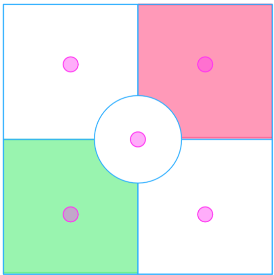

## Spec Ops

* ### Forces

No special restrictions apply to the models the players can include in their Forces in this scenario.

* ### The Battlefield

The players roll-off and the winner sets up the terrain for the game, with the following additional rules.

**Objectives**  
Place five 1” objective markers, one in the center of the battlefield, and the other four in the center of each table quarter, as shown.

**Table Sections**  
The battlefield is divided into five sections: everything within 1/6 the width of the table counts as the center area, and the four quarters of the table excluding that center area as the quarter areas. Deployment zones are opposite quarter areas.

* ### Deployment

The player that did not set up the terrain chooses which Deployment Zone will be theirs. The other Deployment Zone is their opponent’s. The players then alternate deploying their models one at a time, starting with the player who has more models in their Warband (roll-off if both players have the same number of models). Models must be set up wholly within their own Deployment Zone. If a player runs out of models to set up, the other player sets up all their remaining models, one after another until they have none left. Once the players have set up their models, deployment ends and the game begins.

**Infiltrators**  
Infiltrators can deploy normally or by using their special deployment rules.

* ### Tactical Missions

At the start of the game, before deployment, each player secretly chooses three of the following Tactical Missions. At the end of any round after the first, a player can reveal one or more of their Missions for which they have satisfied the requirements to score that Mission, earning VP as described. Once revealed, a Mission cannot be scored again by that player.

#### Home Field

**Requirement.** Control the objective in your own Deployment Zone.  
**Reward.** 1 VP

#### Focused Control

**Requirement.** Control the objective in the center of the battlefield.  
**Reward.** 3 VP

#### Takeover

**Requirement.** Control the objective in your opponent’s Deployment Zone.  
**Reward.** 4 VP

#### Split Decision

**Requirement.** Control one or both objectives that are not the center objective or an objective in a Deployment Zone.  
**Reward.** 1 VP, or 2 VP if you control both

#### Big Game

**Requirement.** Took an enemy ELITE model Out of Action during this Turn.  
**Reward.** 2

#### Assassinate

**Requirement.** Took the enemy Leader Out of Action during this Turn.  
**Reward.** 3

#### Efficiency

**Requirement.** More enemy models than friendly models were taken Out of Action this Turn.  
**Reward.** 2

#### Keep Safe

**Requirement.** No friendly models were taken Out of Action this Turn.  
**Reward.** 2

#### Surround

**Requirement.** At least one friendly model is in each of the four quarter areas, but none in the center area.  
**Reward.** 3

### Game Length

At the end of the fourth Turn, one player rolls a D6. On a 1 or 2, the game ends immediately. On a 3 or more, the game will end at the end of the fifth Turn.

* ### Victory Conditions

A player wins this scenario immediately if there are no enemy models on the battlefield or if the opposing Warband flees (typically due to failing a Morale Check). Otherwise, the player with more Victory Points at the end of the game is the winner.

**Victory Points**  
Players earn VP based on their successful Tactical Missions.

Players earn 1 VP for each scored Glorious Deed, as normal.

* ### Glorious Deeds

**Death From Above.** A friendly model takes an enemy model Out of Action with a Melee Attack that has the Diving Charge modifier.  
**Hold your Ground.** A Warband is the first to pass a Morale Check in this game. In a campaign game you can award 1 Experience Point to 1 ELITE model from the Warband that has the LEADER Keyword if you have one available.  
**In and Out.** You reveal and score all of your Tactical Missions before the fourth Turn begins. If both players qualify, then neither scores this Glorious Deed. In a campaign game you can award 1 Experience Point to 1 ELITE model from the Warband.  
**Live Dangerously.** Retreat from Melee Combat twice with one model during the game.  
**Sniper.** A friendly model takes an enemy ELITE model Out of Action with a Ranged Weapon Attack that has the Long Range modifier.  
**Total Control.** Control 3 or more Objectives at the end of a Turn with all of your Tactical Missions revealed on previous Turns.

