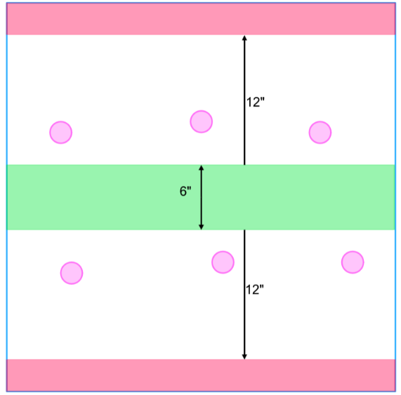

## The Ritual

* ### Forces

Before picking their Forces, the players must decide who is the attacker and who is the defender in this scenario. If one of the players has a Chaos Warband and their opponent does not, the Chaos Warband is the defender. Otherwise, the players roll-off and the winner must decide who will be the attacker and who will be the defender.

* ### The Battlefield

The players roll-off and the winner sets up the terrain for the game, with the following additional rules.

**Objectives**  
After choosing deployment zones, the defender places six 1” objective markers at least 2” away from their deployment zone.

**Controlling Objectives**  
A player controls an objective if they have more models within 3” of that objective that are not Down than their opponent.

* ### Deployment

The attacker’s deployment zone is red zones at the top and bottom of the shown map, while the attacker’s is the green area within 3” of the center line. The players then alternate deploying their models one at a time, starting with the player who has more models in their Warband (roll-off if both players have the same number of models). Models must be set up wholly within their own Deployment Zone. If a player runs out of models to set up, the other player sets up all their remaining models, one after another until they have none left. Once the players have set up their models, deployment ends and the game begins.

**Infiltrators**  
Infiltrators can deploy normally or by using their special deployment rules. The attacker must place their Infiltrators at least 8” away from all Objectives.

### Game Length

This scenario lasts five Turns.

* ### Victory Conditions

A player wins this scenario immediately if there are no enemy models on the battlefield or if the opposing Warband flees (typically due to failing a Morale Check). Otherwise, the player with more Victory Points at the end of the game is the winner.

**Victory Points**  
At the end of each Turn, if the attacker controls an Objective, it is destroyed and removed from the battlefield, and the attacker earns 3 VP. Then the defender earns 1 VP for each objective still on the battlefield.

Players earn 1 VP for each scored Glorious Deed, as normal.

* ### Glorious Deeds

**Banished (Defender Only).** Take an enemy model Out of Action while it is within 3” of an Objective the attacker controls.  
**Bloodletting.** A friendly model causes an enemy model to suffer a sixth BLOOD MARKER.  
**Nuisance (Attacker Only).** Destroy 2 Objectives with the same friendly model (i.e. it is within 3” of those Objectives and not Down when they are destroyed).  
**Reaper.** Take at least three enemies Out of Action with one of your models during the battle.  
**Sabateur (Attacker Only).** A friendly model ends the battle in the defender’s Deployment Zone.  
**Stopgap (Defender Only).** No Objectives are destroyed during a single Turn. In a campaign game you can award 1 Experience Point to 1 ELITE model from the Warband that has the LEADER Keyword if you have one available.

